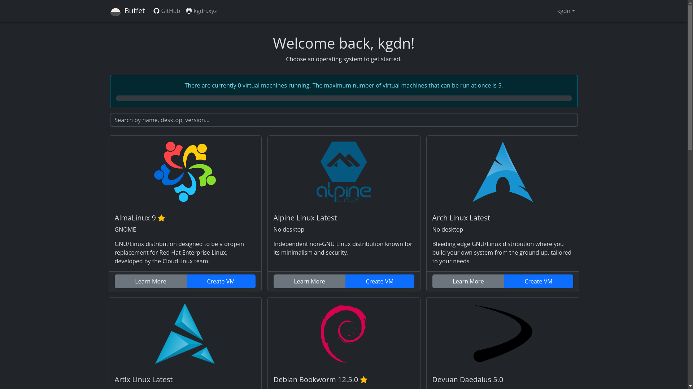
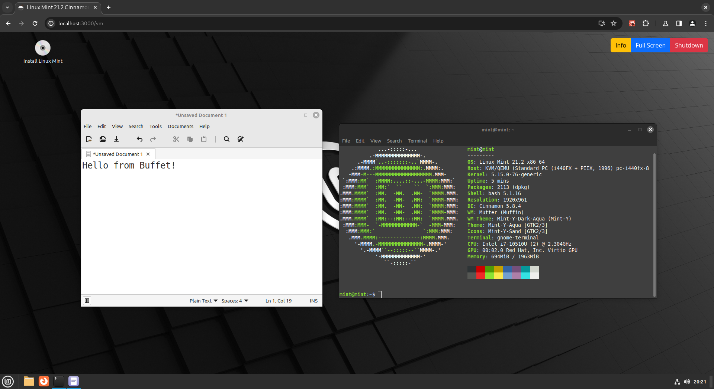

<div align="center" style="margin-bottom: 20px;">
  
</div>

# Buffet [](https://www.gnu.org/licenses/agpl-3.0) [](https://github.com/kgdn/buffet/issues) [](https://github.com/kgdn/buffet/stargazers)

Buffet is a full-stack, fully-featured web-based virtual machine manager that aims to provide a free, open-source, lightweight, easy-to-use, and secure alternative to other web-based virtual machine managers such as [DistroSea](https://distrosea.com/) and [DistroTest](https://www.reddit.com/r/DistroHopping/comments/wqrwbw/what_happened_to_distrotestnet/).
The back-end is written in Python using the [Flask](https://github.com/pallets/flask) web framework, and the front-end is written in JavaScript with the [React](https://github.com/facebook/react) library. Buffet uses [QEMU](https://github.com/qemu/qemu) and [KVM](https://www.linux-kvm.org/) for virtualization, and [noVNC](https://github.com/novnc/noVNC) + [websockify](https://github.com/novnc/websockify) for remote desktop access.

Buffet was made over the course of 12 weeks as part of the final project for my bachelor's degree in Computer Systems at the [School of Mathematical and Computer Sciences](https://www.hw.ac.uk/schools/mathematical-computer-sciences.htm) at [Heriot-Watt University](https://www.hw.ac.uk/). 

> [!IMPORTANT]
> **Please note that Buffet is not intended for production use, as it is still in the early stages of development.** 
>
> However, you are welcome to use it for testing and development purposes. Please report any bugs or issues you encounter on the [Issues](https://github.com/kgdn/buffet/issues) page. Feel free to contribute to the project by submitting a pull request.

## Features

- Create, start, stop, and delete QEMU/KVM virtual machines
- Connect to virtual machines using noVNC and websockify
- Manage virtual machine images, logos, and distributions using a JSON file
- Administer users, virtual machines and logs from the admin panel
- Secure user authentication and authorisation using JSON Web Tokens (JWT) and bcrypt
- Lightweight and easy to install on any GNU/Linux server

## Screenshots

<div align="center">
    
    <p>The dashboard showing the virtual machines</p>
</div>

<div align="center">
    
    <p>A virtual machine running Linux Mint</p>
</div>

## Installation

This section is only for people, including systems administrators, who want to install Buffet on their own servers.

### Front-end Installation

The front-end is a React application that communicates with the back-end using the REST API. It is designed to be lightweight, easy to install, and easy to use. 

> [!NOTE]
> You can install the front-end on any server that supports Node.js and npm, i.e. on Windows, macOS, or GNU/Linux.

#### Requirements

- Node.js v20.10.0 or later
- npm 10.4.0 or later

#### Instructions

1. Clone the repository:

```bash
git clone https://github.com/kgdn/buffet.git
```

2. Change into the `client` directory:
```bash
cd client
```

3. Install the required dependencies:
```bash
npm install
```

4. Create a .env file in the `client` directory with the following contents:

**`.env`**
```bash
BROWSER= # none
GENERATE_SOURCEMAP= # true or false
REACT_APP_BASE_URL= # url of api (e.g. http://localhost)
REACT_APP_BASE_PORT= # port of api (e.g. 8000)
```

5. Start the development server (optional):
```bash
npm start
```

6. Build the production version:
```bash
npm run build
```

### Back-end Installation

The back-end is a Flask application that provides the REST API for the front-end. 

> [!NOTE]
> Unlike the front-end, the back-end is designed to be installed on a GNU/Linux server, as it makes extensive use of QEMU and KVM for virtualization. You can install the back-end on any GNU/Linux distribution that supports Python 3 and pip. Ensure that you have the required dependencies installed before proceeding.

#### Requirements

- Python 3.12.2 or later
- pip 23.2.1 or later
- venv for Python 3
- QEMU 8.1.3 or later
- Any GNU/Linux distribution for the host operating system
- Virtualization support enabled in the BIOS/UEFI settings
- KVM kernel module loaded

> [!TIP]
> You can check if the KVM kernel module is loaded by running the following command:

```bash
lsmod | grep kvm
```

You should see output similar to the following:

```bash
kvm_intel             425984  0
kvm_amd                98304  0
kvm                  1376256  1 kvm_intel
irqbypass              12288  1 kvm
```

If you do not see any output, you may need to load the KVM kernel module manually:

```bash
sudo modprobe kvm
```
 
#### Instructions

1. Clone the repository:

```bash
git clone https://github.com/kgdn/buffet.git
```

2. Change into the `server` directory:
```bash
cd server
```

3. Create a virtual environment:
```bash
python3 -m venv .venv
```

4. Activate the virtual environment:
```bash
source .venv/bin/activate
```

5. Install the required dependencies:
```bash
pip install -r requirements.txt
```

6. Create a .env file in the `server` directory with the following contents:

**`.env`**
```bash
SECRET_KEY= # your_secret
SQLALCHEMY_DATABASE_URI= # your_database_uri
SQLALCHEMY_TRACK_MODIFICATIONS= # True or False
SQLALCHEMY_ECHO= # True or False
JWT_SECRET_KEY= # your_secret_key
JWT_COOKIE_CSRF_PROTECT= # True or False
JWT_COOKIE_SECURE= # True or False
JWT_TOKEN_LOCATION= # headers, cookies, query_string or json
JWT_ACCESS_TOKEN_EXPIRES= # access_token_expires (int)
JWT_REFRESH_TOKEN_EXPIRES= # refresh_token_expires (int)
CORS_HEADERS= # Content-Type
MAIL_SERVER= # SMTP server
MAIL_PORT= # SMTP port
MAIL_USERNAME= # your_email
MAIL_PASSWORD= # your_password
MAIL_DEFAULT_SENDER= # your_email
MAIL_MAX_EMAILS= # max_emails (int)
MAIL_ASCII_ATTACHMENTS= # True or False
FRONT_END_ADDRESS= # localhost
BACK_END_ADDRESS= # localhost
```

7. Put your virtual machine images in the `iso` directory, and create an `index.json` file in the `iso` directory with the following structure:
```jsonc
[
    {
        "iso": "archlinux.iso", // name of the ISO file
        "desktop": "No desktop", // desktop environment
        "name": "Arch Linux", // name of the distribution
        "version": "Latest", // version of the distribution
        "description": "Bleeding edge GNU/Linux distribution where you build your own system from the ground up, tailored to your needs.", // description of the distribution
        "linux": true, // whether the distribution uses the Linux kernel or not
        "logo": "archlinux.png", // name of the logo file found in the iso/logos directory
        "homepage": "https://archlinux.org", // homepage of the distribution
        "beginner_friendly": false // whether the distribution is beginner-friendly or not
    }, // add more distributions here
]
```

8. Create a `logos` directory in the `iso` directory and put your distribution logos in it.
```bash
mkdir iso/logos
mv archlinux.png iso/logos
```

9. Start the development server (optional):
```bash
flask -A app run
```

10. Run the production server:
```bash
gunicorn --bind 0.0.0.0:8000 --workers 4 app:app
```